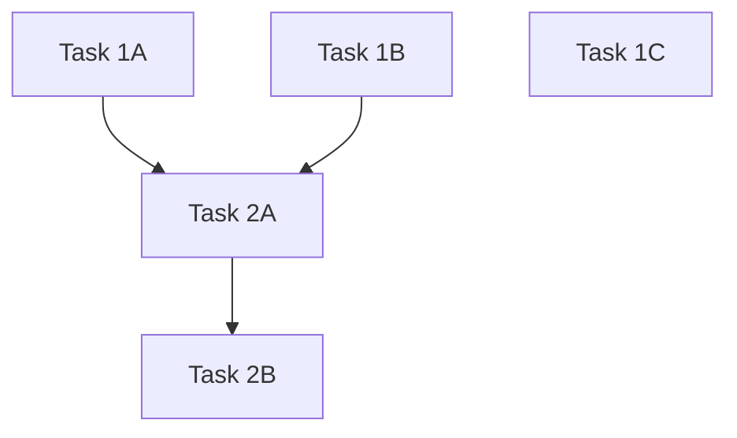

# Task Decomposer: Parallel Work Breakdown System

## When to use this skill
- User provides a list/checklist of features or changes to implement
- User asks to "break down" or "decompose" tasks
- User mentions wanting to run tasks "in parallel"
- User asks for "specific prompts" for each task
- User wants to understand dependencies between changes

## Overview
This skill analyzes requested changes, explores the codebase to understand where changes need to be made, identifies dependencies, and generates specific prompts that can be executed in parallel by separate agents.

---

## Workflow

### Phase 1: Requirements Gathering
```markdown
## Checklist: Requirements
- [ ] Collect all requested changes from user
- [ ] Clarify any ambiguous requirements
- [ ] Identify if changes involve DB schema updates
- [ ] Note any explicit dependencies mentioned
```

### Phase 2: Codebase Exploration
Use the Task tool with `subagent_type=Explore` to deeply understand:
1. **File locations** for each feature area mentioned
2. **Database schema** (check `docs/DATABASE.md`, migrations, or use Supabase MCP)
3. **Component relationships** (imports, shared state, props)
4. **Server actions** that would need modification
5. **Existing patterns** for similar functionality

**Exploration Prompt Template:**
```
Explore this codebase to understand [FEATURE AREA]. Find:
1. All files related to [FEATURE]
2. Database tables/columns involved
3. Server actions that handle [FEATURE]
4. Components that render [FEATURE]
5. Any shared state or context

Return file paths, key functions, and relationships.
Do NOT make changes - research only.
```

### Phase 3: Dependency Analysis
For each requested change, determine:

| Question | Impact |
|----------|--------|
| Does it require DB schema changes? | Must be done first |
| Does it modify shared components? | Check for conflicts |
| Does it depend on another change's output? | Sequential |
| Is it isolated to specific files? | Can parallelize |

**Dependency Categories:**
1. **Database migrations** - Always sequential, do first
2. **Shared utilities/types** - May block dependent tasks
3. **UI components** - Usually parallelizable if different files
4. **Server actions** - Parallelizable if different functions

### Phase 4: Task Grouping
Group tasks into:

```
PARALLEL GROUP [N]: [Group Name]
├── Task [N]A: [Name] - Files: [list]
├── Task [N]B: [Name] - Files: [list]
└── Task [N]C: [Name] - Files: [list]

SEQUENTIAL GROUP [N]: [Group Name]
├── Task [N]A: [Name] (DO FIRST) - Files: [list]
└── Task [N]B: [Name] (REQUIRES [N]A) - Files: [list]
```

### Phase 5: Prompt Generation
For each task, generate a prompt following this template:

---

## Prompt Template

```markdown
## Task: [TASK_NAME]
**Group:** [PARALLEL/SEQUENTIAL] Group [N]
**Dependencies:** [None / Requires Task X to complete first]
**Output File:** `.task-outputs/[task-id].md`

### Pre-Flight Check
[If has dependencies]
Before starting, verify dependencies are complete:
1. Check `.task-outputs/[dependency-task-id].md` exists
2. Confirm it contains "STATUS: COMPLETE"
3. If not complete, STOP and report dependency not met

### Files to Modify
- `/path/to/file1.tsx` - [What to change]
- `/path/to/file2.ts` - [What to change]

### Requirements
1. [Specific requirement 1]
2. [Specific requirement 2]
3. [Specific requirement 3]

### Implementation Steps
1. [Step 1 with specific details]
2. [Step 2 with specific details]
3. [Step 3 with specific details]

### Validation
- [ ] [Check 1]
- [ ] [Check 2]
- [ ] Build passes: `npm run build`
- [ ] No lint errors: `npm run lint`

### Output
When complete, create `.task-outputs/[task-id].md` with:
```
# Task: [TASK_NAME]
STATUS: COMPLETE
FILES_MODIFIED:
- /path/to/file1.tsx
- /path/to/file2.ts
NOTES:
[Any important notes for dependent tasks]
```
```

---

## Output Structure

Create a master tracking file at `.task-outputs/TASK_PLAN.md`:

```markdown
# Task Decomposition Plan
Generated: [DATE]
Total Tasks: [N]
Parallel Groups: [N]
Sequential Groups: [N]

## Dependency Graph


## Execution Order

### Wave 1 (Parallel)
- [ ] Task 1A: [Name]
- [ ] Task 1B: [Name]
- [ ] Task 1C: [Name]

### Wave 2 (After Wave 1)
- [ ] Task 2A: [Name] (requires: 1A, 1B)

### Wave 3 (After Wave 2)
- [ ] Task 2B: [Name] (requires: 2A)

## Individual Task Prompts
[Links to each task prompt file]
```

---

## Instructions

### Step 1: Gather Requirements
Ask user to provide their full list of changes. If unclear, ask:
- "Which changes are must-haves vs nice-to-haves?"
- "Are there any changes that MUST be done in a specific order?"
- "Do any changes involve database schema updates?"

### Step 2: Deep Exploration
Launch Explore agents for each major feature area:
```
Task tool with subagent_type=Explore
Focus: [Feature Area]
Goal: Map all files, functions, and relationships
```

### Step 3: Build Dependency Map
Create a matrix:
| Task | Modifies | Depends On | Can Parallel With |
|------|----------|------------|-------------------|
| A    | file1.tsx | None | B, C |
| B    | file2.tsx | None | A, C |
| C    | schema | None | A, B |
| D    | file1.tsx | C | None |

### Step 4: Generate Prompts
For each task:
1. Write specific file paths (absolute)
2. Include code patterns from exploration
3. Reference existing similar code
4. Add pre-flight dependency checks
5. Define clear completion criteria

### Step 5: Output Files
Create in `.task-outputs/`:
```
.task-outputs/
├── TASK_PLAN.md          # Master plan
├── task-1a-prompt.md     # Individual prompts
├── task-1b-prompt.md
├── task-1c-prompt.md
└── [completion markers created by agents]
```

---

## Best Practices

### DO:
- Use absolute file paths
- Reference specific function names found during exploration
- Include existing code patterns as examples
- Make dependencies explicit with file checks
- Keep prompts focused (one concern per task)

### DON'T:
- Guess file locations without exploring first
- Create tasks that modify the same file (conflicts)
- Assume database schema without checking
- Bundle unrelated changes into one task
- Skip the exploration phase

---

## Example Session

**User:** "Add delete buttons to session/client/occasion profiles, update dashboard greeting, and add time to session dates"

**Agent Response:**
1. Launch 3 Explore agents in parallel:
   - Explore admin profiles (session, client, occasion)
   - Explore user dashboard
   - Explore session date handling + DB schema

2. Analyze results, identify:
   - Delete buttons: 3 independent tasks (parallel)
   - Dashboard greeting: 1 independent task (parallel)
   - Session time: 2 sequential tasks (DB first, then UI)

3. Generate TASK_PLAN.md with 6 tasks:
   - Wave 1 (parallel): Delete session, Delete client, Delete occasion, Dashboard greeting
   - Wave 2 (sequential): DB migration for time
   - Wave 3 (requires Wave 2): UI updates for time

4. Create individual prompt files with pre-flight checks

---

## Resources
See `resources/prompt-templates.md` for additional prompt templates.
